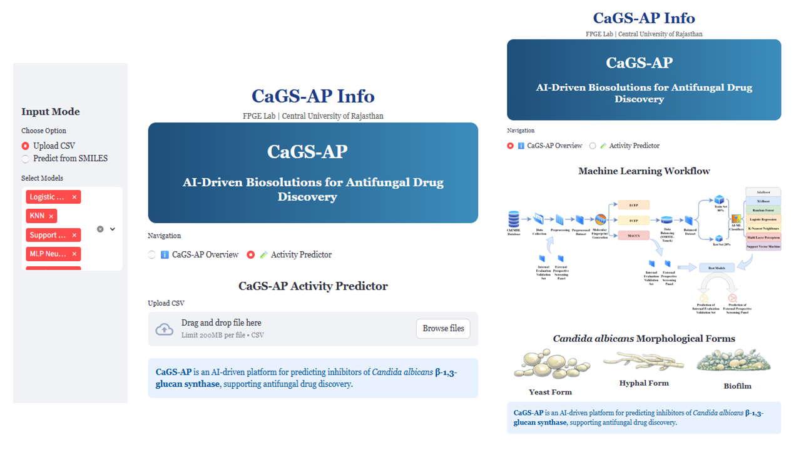

# CaGS-AP : _Candida albicans_ β-1,3-Glucan Synthase - Activity Predictor

CaGS-AP is a machine-learning powered platform for predicting the inhibitory activity of small molecules against **_Candida albicans_ β-1,3-glucan synthase (CaGS)** — a clinically validated antifungal drug target.

This tool enables **virtual screening, hit-prioritization, and activity confidence assessment** using an ensemble of optimized machine-learning classifiers.

---

## 🏛 Affiliation

**Fungal Biology Lab**  
**Central University of Rajasthan, India**

**Authors**
- *Arvind V. Kayande*
- *Prof. Gajanan B. Zore* _(Corresponding Author)_

---

## 📌 Application Overview

CaGS-AP allows users to:

✔ Upload chemical datasets (SMILES format)  
✔ Predict CaGS inhibitory activity  
✔ Compute model-consensus probability  
✔ Rank hits automatically  
✔ Assess prediction confidence  
✔ Perform scaffold-level SAR analysis  
✔ Save publication-ready plots & reports  

The tool is implemented in **Python + Streamlit**, supporting both **batch screening** and **single-molecule prediction** modes.
---

## 🚀 Quick Access (Web App)

You can access the tool directly without installing anything by visiting the following link:

👉 **[Launch CaGS-AP Web App](https://cagsap-fungal-biology-lab.streamlit.app/)**

---
## 📂 Input Format

Upload a `.csv` file containing a column with **SMILES** strings.

Example:

SMILES
CCOc1ccc2nc(SCc3ccccc3)sc2c1
CCC(=O)NCCC1=CNc2ccccc21

The app will output:

• predicted activity probability
• model vote
• prediction confidence
• ranked hit list

---

## 📊 Key Features

- Ensemble ML prediction  
- Consensus probability scoring  
- Hit ranking  
- Probability distribution visualization  
- Model vote analysis  
- Scaffold-level SAR  
- High-resolution figure export  
- Auto-generated reports  

---

## ⚖ License

This project is released under the **MIT License**.  
You are free to use, modify, and distribute this software with appropriate citation.

---

## 🧪 Intended Use

This tool is developed **for academic research & drug discovery workflow support**.  
It is not intended for clinical or diagnostic use. Experimental validation is essential.

---

## 🙏 Acknowledgement

We thank **Central University of Rajasthan** for infrastructure support.

---

## 📧 Contact

For queries, please contact:

📩 *avikayande0007@gmail.com*  
📩 *2022phdbt010@curaj.ac.in*

---

⭐ If you find CaGS-AP useful, please consider citing our work (citation coming soon).

